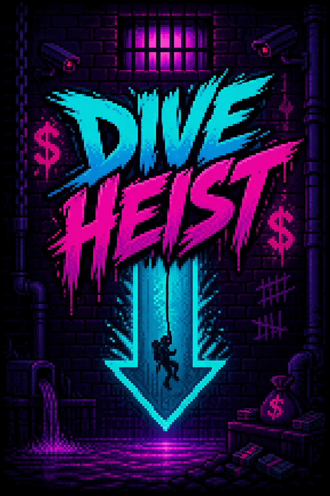
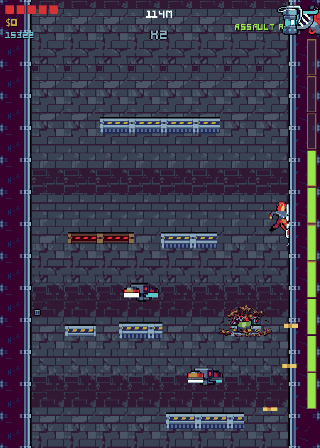
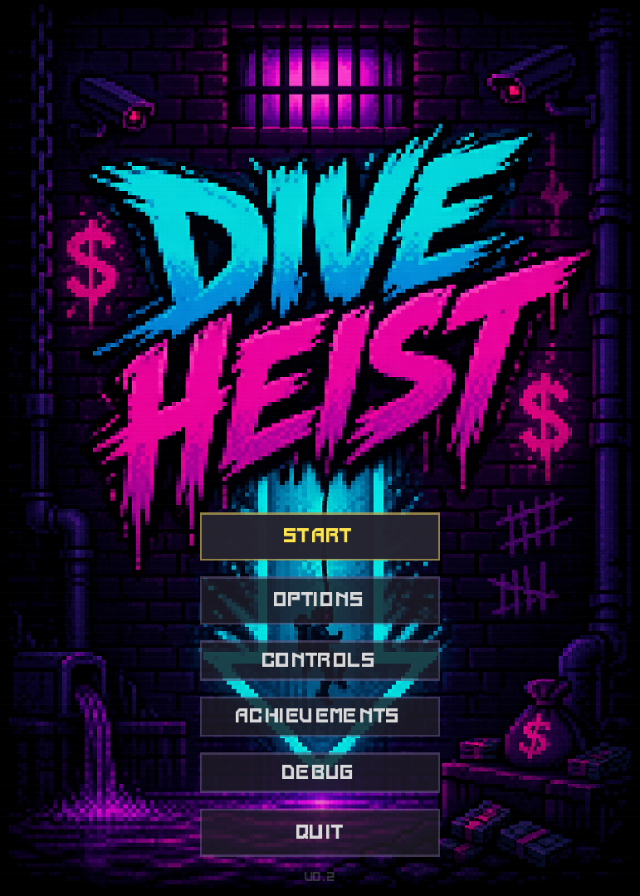
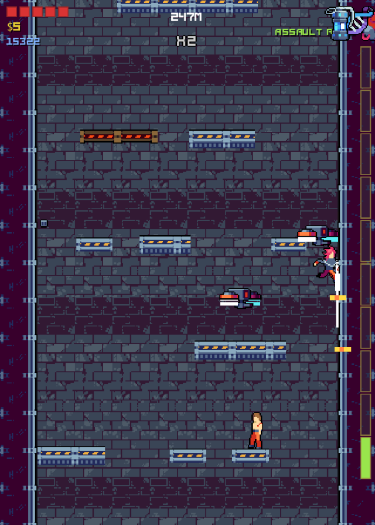
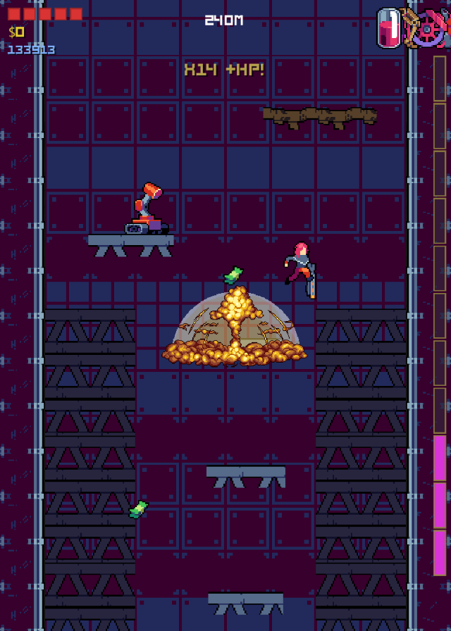

<div align="center">



**A vertical-descent roguelike inspired by *Downwell*, set in a cyberpunk underworld.**
*Fall. Shoot. Stomp. Combo. Repeat.*

[](https://godotengine.org/)
[](https://docs.godotengine.org/en/stable/tutorials/scripting/gdscript/)
[](../../releases)
[](LICENSE)

[**⬇ Download the demo**](../../releases/latest) · [Game Design Document](docs/GDD.md) · [Architecture](docs/ARCHITECTURE.md)



</div>

---

## About

**Dive Heist** is a fast-paced roguelike where the only way forward is **down**. You dive through a
procedurally generated shaft, shooting beneath your feet and stomping enemies to stay airborne.
Every kill in mid-air feeds a combo that you only cash in when you land — so each jump is a
risk/reward decision: keep falling for a bigger payout, or touch down and bank what you have?

Between levels you spend your loot in rest rooms (shops, treasure vaults, weapon armories) and
pick a perk to shape your build. A rising red hazard from above keeps you from playing it safe.

The demo contains **two complete eras — Prison and Factory — with 6 levels and 2 bosses**.

## Screenshots

<div align="center">

| Main menu | Prison | Factory |
|:---:|:---:|:---:|
|  |  |  |

</div>

## Features

- **Gunboots-style combat** — shooting down slows your fall; stomping refills ammo and bounces you back up.
- **Air combo system** — chain kills without landing; cash in on touchdown for HP, bonus ammo or invincibility. Alternating stomps and shots grants a *style bonus*.
- **11 weapons** with distinct bullet behaviours: homing, piercing, ricochet, explosive, split, burst, spread and a hold-to-fire laser.
- **16 perks** chosen after each level (Glass Cannon, Vampire, Blast Stomp, Jetpack…).
- **2 eras, 6 levels, 2 bosses** — the Prison *Warden* and the Factory *Loader*, each with telegraphed, position-aware attack patterns.
- **10 enemy types** — patrollers, chasers, wall-climbers, dive-bombers, bombers, chargers and armoured bruisers.
- **Procedural generation** — chunk-based level streaming, squad formations, zone templates and difficulty that ramps within every level.
- **Rest rooms** — Shop, Money (6 challenge variants, including mimic chests) and Weapon rooms.
- **Urge hazard** — a rising danger zone that pushes you to keep descending.
- **Game feel** — hitstop, screen shake, parallax backgrounds, death VFX, per-era music and 40+ SFX.
- **Achievements**, pause menu, audio options and **full gamepad support**.

## Controls

| Action | Keyboard | Gamepad |
|---|---|---|
| Move | `A` / `D` or `←` / `→` | Left stick / D-pad |
| Jump · **Shoot** (in the air) | `Space`, `W` or `↑` | `A` / `RB` |
| Interact / enter door | `S` or `↓` | `X` |
| Pause / back | `Esc` | `Start` |

> Jump and shoot share the same button: on the ground it jumps, in the air it fires downwards.

## Play it

### Download

Grab the latest build for **Windows** or **Linux** from the [Releases page](../../releases/latest).
They are single-file executables — no installation needed.

> On Linux, mark the file as executable first: `chmod +x DiveHeist.x86_64`.

### Run from source

1. Install [Godot 4.6](https://godotengine.org/download) (standard build, not .NET).
2. Clone the repository:
   ```bash
   git clone https://github.com/bluefireF5ran/dive-heist.git
   ```
3. In the Godot Project Manager choose **Import**, select `project.godot`, and press **F5** to play.

### Export

Export presets for Windows and Linux are included (`export_presets.cfg`). With the Godot export
templates installed:

```bash
godot --headless --export-release "Windows Desktop" build/windows/DiveHeist.exe
godot --headless --export-release "Linux"           build/linux/DiveHeist.x86_64
```

## Project structure

```
dive-heist/
├── project.godot          # Engine config, input map, autoloads
├── export_presets.cfg     # Windows / Linux export presets
├── Scenes/
│   ├── Player/            # Player controller: movement, weapons, combo, perks
│   ├── Enemies/           # Base enemy, prison & factory enemies, bosses
│   ├── Levels/            # World, chunk generator, platforms, hazards
│   ├── Rooms/             # Shop / Money / Weapon rest rooms and doors
│   ├── Weapons/           # Bullet types and muzzle flash
│   ├── Collectibles/      # Money and gem crates
│   ├── UI/                # Main menu, HUD, pause menu, perk selection, toasts
│   ├── VFX/               # Explosions, particles, text popups
│   ├── Systems/           # Autoloads: achievements, settings, gamepad bindings
│   └── Audio/             # SFX autoload (pooled AudioStreamPlayers)
├── Sprites/Active_Sprites/ # Every sprite/font the game loads (see MANIFEST.md)
├── Audio/
│   ├── SFX/               # Sound effects
│   └── Soundtrack/        # Music, one pool per era
└── docs/
    ├── GDD.md             # Game Design Document (Spanish)
    ├── ARCHITECTURE.md    # Technical reference: scripts, signals, collision, generation
    ├── pitch.pdf          # Project pitch
    └── plans/             # Sprint plans and elevator pitch
```

## Technical highlights

- **Chunk streaming** — the world is spawned and freed in chunks around the camera, which only ever moves down.
- **Signal-driven architecture** — gameplay systems communicate via signals connected in code; global services (`SFX`, `Achievements`, `Settings`) are autoloads.
- **Custom-drawn HUD** — ammo bar, HP pips, combo meter and perk icons rendered with `_draw()`.
- **Hitstop without freezing the game loop** — the world pauses the tree while its own timers keep running (`PROCESS_MODE_ALWAYS`).
- **Linted code** — GDScript is checked with [`gdtoolkit`](https://github.com/Scony/godot-gdscript-toolkit):
  ```bash
  pip install gdtoolkit
  gdlint Scenes/
  ```

See [`docs/ARCHITECTURE.md`](docs/ARCHITECTURE.md) for the full technical reference and
[`docs/GDD.md`](docs/GDD.md) for the complete game design (in Spanish).

## Roadmap

- [x] Era 1 — Prison (3 levels + Warden boss)
- [x] Era 2 — Factory (3 levels + Loader boss)
- [ ] Era 3 — Laboratory
- [ ] Era 4 — Bank
- [ ] Era 5 — Bank escape

## Credits

**Design & programming:** Francisco ([@bluefireF5ran](https://github.com/bluefireF5ran))

**Art:** pixel-art asset packs from [Craftpix](https://craftpix.net) (tilesets, characters, bosses,
drones, explosions, guns, UI font) and Scraper cyberpunk packs. Used under their respective licenses.

**Audio:** music and sound effects generated with AI audio tools for this project.

**Engine:** [Godot Engine](https://godotengine.org).

## License

The **source code** is released under the [MIT License](LICENSE).
Art and audio assets are **not** covered by the MIT license and remain under their
original licenses — see [Credits](#credits).
