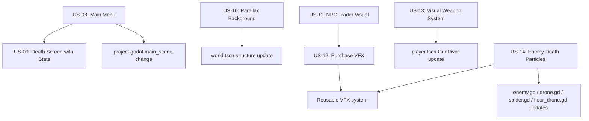
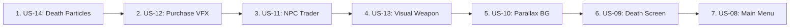

# Sprint 2 — Polish & Feel: Implementation Plan

> **Goal:** Transform the playable alpha into a polished, juicy game experience.
> **Scope:** US-08 through US-15 from the GDD backlog.
> **Prerequisite:** Sprint 1 (Prison Alpha) — ✅ Complete.

---

## Feature Dependency Graph



---

## US-08: Main Menu

**Status:** 📋 New | **GDD Ref:** US-08

### What
A title screen that appears on launch with Start and Options buttons, replacing the current direct-to-gameplay boot.

### Files to Create
| File | Purpose |
|------|---------|
| `Scenes/UI/main_menu.tscn` | Main menu scene — Node2D root |
| `Scenes/UI/main_menu.gd` | Menu logic — button handling, transitions |

### Files to Modify
| File | Change |
|------|--------|
| `project.godot` | Change `run/main_scene` to `res://Scenes/UI/main_menu.tscn` |

### Implementation Details

1. **Scene structure:**
   ```
   main_menu.tscn (Node2D)
   ├── Background (Sprite2D — dark prison tile or solid color)
   ├── Title (drawn via _draw or Label — DIVE HEIST)
   ├── StartButton (Button — Start Game)
   ├── OptionsButton (Button — Options, placeholder)
   └── QuitButton (Button — Quit, desktop only)
   ```

2. **Visual style:**
   - Dark background matching the prison theme `Color(0.08, 0.07, 0.1)`
   - Title in cyberpunk font `CyberpunkCraftpixPixel.otf`, large size, centered
   - Buttons styled minimally — pixel-art friendly, using the same font
   - Optional: subtle camera drift or animated background tiles

3. **Start flow:**
   - `StartButton.pressed` → `get_tree().change_scene_to_file("res://Scenes/Levels/world.tscn")`
   - Simple fade transition using a ColorRect overlay + tween

4. **Options placeholder:**
   - Volume sliders for Music and SFX buses
   - Can be a simple panel that shows/hides

5. **Input:** Add `ui_accept` or reuse `jump` input for keyboard start

### Acceptance Criteria
- [ ] Game boots to main menu instead of gameplay
- [ ] Start button transitions to world.tscn
- [ ] Options panel has Music/SFX volume sliders
- [ ] Quit button exits the application
- [ ] Cyberpunk font used for all text

---

## US-09: Enhanced Death Screen with Stats

**Status:** 📋 New | **GDD Ref:** US-09

### What
Replace the simple GAME OVER overlay with a stats-rich death screen showing depth, kills, money, and max combo.

### Files to Modify
| File | Change |
|------|--------|
| `Scenes/Levels/world.gd` | Add cumulative stat tracking: total kills, total money, overall max combo |
| `Scenes/UI/ammo_hud.gd` | Add death screen state vars: `ds_kills`, `ds_money`, `ds_max_combo`, `ds_depth` |
| `Scenes/UI/ammo_bar.gd` | Redraw `_draw_game_over()` to show stats in a styled panel |

### Implementation Details

1. **Cumulative stats in `world.gd`:**
   - Add `_total_kills: int`, `_total_money_earned: int`, `_overall_max_combo: int`
   - Update these in `_on_combo_changed()`, `_on_money_changed()`, and combo tracking
   - Pass all stats to `ammo_hud.show_death_screen(...)` on player death

2. **Death screen layout in `ammo_bar.gd`:**
   ```
   ┌─────────────────────────┐
   │      GAME OVER          │  ← Red, large
   │                         │
   │   Depth:    XXXXm       │
   │   Kills:    XXX         │
   │   Money:    $XXX        │
   │   Max Combo: xXX        │
   │                         │
   │   JUMP to retry         │  ← Pulsing
   └─────────────────────────┘
   ```

3. **Visual improvements:**
   - Darker overlay `Color(0, 0, 0, 0.75)`
   - Stats in a centered column with labels left-aligned, values right-aligned
   - Gold color for money, red for depth, white for kills/combo
   - Pulsing restart hint continues from existing pattern

### Acceptance Criteria
- [ ] Death screen shows depth reached, total kills, total money, max combo
- [ ] Stats are cumulative across all levels in the run
- [ ] Visual style matches the cyberpunk HUD aesthetic
- [ ] JUMP to restart still works

---

## US-10: Parallax Background System

**Status:** 📋 New | **GDD Ref:** US-10

### What
Add 2-3 parallax scrolling background layers behind the well to create depth and atmosphere.

### Available Assets
| Asset | Path | Layers |
|-------|------|--------|
| Futuristic City | `Sprites/Craftpix/3. Backgrounds/craftpix-net-219100-free-futuristic-city-pixel-art-backgrounds/` | 4+ layers per city theme |
| City Pixel Art | `Sprites/Craftpix/3. Backgrounds/craftpix-468111-pixel-art-game-city-backgrounds/` | City1/City4 with multiple layers |

### Files to Create
| File | Purpose |
|------|---------|
| `Scenes/Levels/parallax_background.gd` | Script managing vertical parallax layers |

### Files to Modify
| File | Change |
|------|--------|
| `Scenes/Levels/world.tscn` | Add ParallaxBackground + ParallaxLayer nodes |
| `Scenes/Levels/world.gd` | Optional: pass camera position to parallax if needed |

### Implementation Details

1. **Node structure in world.tscn:**
   ```
   world.tscn
   ├── ParallaxBackground          ← parallax_background.gd
   │   ├── FarLayer (ParallaxLayer)    — scroll_scale 0.1, mirroring vertical
   │   ├── MidLayer (ParallaxLayer)    — scroll_scale 0.3, mirroring vertical
   │   └── NearLayer (ParallaxLayer)   — scroll_scale 0.6, mirroring vertical
   ├── Player
   ├── Camera2D
   ├── ChunkGenerator
   ...
   ```

2. **Parallax approach:**
   - Godot's `ParallaxBackground` auto-follows the camera
   - Each `ParallaxLayer` has `motion_mirroring` set to texture height for infinite vertical scroll
   - `motion_scale` controls speed: far=0.1, mid=0.3, near=0.6
   - Since camera only moves DOWN, vertical mirroring is the key concern

3. **Layer selection from assets:**
   - **Far:** Sky/deep background — slowest, darkest
   - **Mid:** Distant buildings/structures — medium speed
   - **Near:** Close pipes/walls/industrial details — fastest
   - Tint layers darker to match prison atmosphere
   - Use `modulate = Color(0.3, 0.3, 0.4)` or similar to darken

4. **Sizing considerations:**
   - Viewport is 320×448
   - Background textures may need to be resized/tiled to fit 320px width
   - Set `texture_repeat = TEXTURE_REPEAT_ENABLED` on Sprite2D nodes
   - Mirroring height = texture height for seamless vertical scroll

### Acceptance Criteria
- [ ] 2-3 parallax layers visible behind the well
- [ ] Layers scroll at different speeds as camera descends
- [ ] Seamless vertical tiling with no visible gaps
- [ ] Dark/moody color matching the prison theme
- [ ] No performance impact on chunk generation

---

## US-11: NPC Trader Visual

**Status:** 📋 New | **GDD Ref:** US-11

### What
Replace the NPC placeholder in the shop stance with the Arms Dealer sprite, including idle and trade animations.

### Available Assets
| Sprite | Path |
|--------|------|
| Idle | `Sprites/Craftpix/1.Personajes/trader-cyberpunk-pixel-art-pack/3 Arms dealer/Idle.png` |
| Trade | `Sprites/Craftpix/1.Personajes/trader-cyberpunk-pixel-art-pack/3 Arms dealer/Trade.png` |
| Hurt | `...Hurt.png` |
| Death | `...Death.png` |
| Walk | `...Walk.png` |

### Files to Modify
| File | Change |
|------|--------|
| `Scenes/Rooms/shop_stance.tscn` | Replace NPC Sprite2D with AnimatedSprite2D using Arms Dealer frames |
| `Scenes/Rooms/shop_stance.gd` | Add animation control — idle by default, play Trade on purchase |

### Implementation Details

1. **AnimatedSprite2D setup in shop_stance.tscn:**
   - Replace the current `$NPC/Sprite2D` with `$NPC/AnimatedSprite2D`
   - Create SpriteFrames resource with:
     - `idle` animation: Idle.png (single frame or loop)
     - `trade` animation: Trade.png (single frame, plays on purchase)
   - Set `idle` as default autoplay

2. **Animation trigger in `shop_stance.gd`:**
   - Connect each `shop_item.purchased` signal to a handler
   - On purchase: play `trade` animation, then return to `idle` after 0.5s
   ```gdscript
   func _on_item_purchased(_item_id: String) -> void:
       npc_sprite.play("trade")
       await get_tree().create_timer(0.5).timeout
       npc_sprite.play("idle")
   ```

3. **Sprite scale/position:**
   - Arms Dealer sprites may be larger than the current placeholder
   - Scale to fit within the room (320×200 space)
   - Position behind the shop counter area

### Acceptance Criteria
- [ ] Arms Dealer sprite visible in shop stance
- [ ] Idle animation plays by default
- [ ] Trade animation triggers when player purchases an item
- [ ] Sprite is correctly sized and positioned within the room

---

## US-12: Purchase Feedback VFX

**Status:** 📋 New | **GDD Ref:** US-12

### What
Add visual feedback when purchasing items: particle burst + floating "SOLD!" text.

### Files to Create
| File | Purpose |
|------|---------|
| `Scenes/VFX/text_popup.tscn` | Reusable floating text popup — Label + tween |
| `Scenes/VFX/text_popup.gd` | Auto-floating, auto-fading text |
| `Scenes/VFX/purchase_particles.tscn` | CPUParticles2D burst effect for purchases |

### Files to Modify
| File | Change |
|------|--------|
| `Scenes/Rooms/shop_item.gd` | Spawn particles + text popup on successful purchase |

### Implementation Details

1. **Text Popup (`text_popup.tscn`):**
   ```
   Node2D
   └── Label (text, centered, cyberpunk font)
   ```
   - Script: float upward 20px, fade out over 0.8s, then `queue_free()`
   - Exported: `text`, `color` (default gold)
   - Usage: `var popup := TEXT_POPUP.instantiate(); popup.text = "SOLD!"; popup.position = global_position; get_tree().current_scene.add_child(popup)`

2. **Purchase Particles:**
   - `CPUParticles2D` with burst config:
     - `amount = 12`, `one_shot = true`, `explosiveness = 0.9`
     - Gold/yellow color, small squares
     - Spread 360°, initial velocity 40-80
     - Gravity = 0, fade out via color ramp
   - Auto-free after emission finishes

3. **Integration in `shop_item.gd`:**
   - After `_apply_item()` succeeds, instantiate both VFX at item position
   - Current fade-out tween remains for the item itself

### Acceptance Criteria
- [ ] Gold particle burst plays on purchase
- [ ] "SOLD!" text floats up and fades at purchase position
- [ ] VFX auto-cleans after animation
- [ ] No performance issues with repeated purchases

---

## US-13: Visual Weapon System

**Status:** 📋 New | **GDD Ref:** US-13

### What
Display a gun sprite on the player's GunPivot that rotates with aim direction, providing visual feedback for the weapon.

### Asset Note
The GDD references `Sprites/Craftpix/free-guns-pack-2/` but this directory was not found in the workspace. The gun sprites may need to be downloaded, or simple placeholder sprites can be created.

### Files to Create
| File | Purpose |
|------|---------|
| `Scenes/Weapons/weapon_sprite.gd` | Simple script managing gun visual on GunPivot |

### Files to Modify
| File | Change |
|------|--------|
| `Scenes/Player/player.tscn` | Add Sprite2D child to GunPivot for gun visual |
| `Scenes/Player/player.gd` | Optional: add weapon type variable for future weapon swapping |

### Implementation Details

1. **GunPivot structure in player.tscn:**
   ```
   Player (CharacterBody2D)
   ├── Protagonista (AnimatedSprite2D)
   └── GunPivot (Node2D)
       ├── GunSprite (Sprite2D) ← NEW: gun texture, offset downward
       └── MuzzlePoint (Marker2D)
   ```

2. **Gun sprite:**
   - Position: offset below GunPivot origin so it appears below the player
   - The GunPivot already rotates to point downward when shooting
   - Use a simple pixel-art gun sprite (even a 4×12 colored rectangle as initial placeholder)
   - Flip V based on direction if needed

3. **Future weapon swapping:**
   - Add `current_weapon: String = "pistol"` to player.gd
   - Gun sprite texture can be swapped based on weapon type
   - This lays groundwork for US-19 (different weapon mechanics) in Sprint 3

4. **Muzzle flash alignment:**
   - MuzzlePoint should be at the tip of the gun sprite
   - Verify muzzle_flash.tscn still aligns correctly after adding the gun visual

### Acceptance Criteria
- [ ] Gun sprite visible on player, attached to GunPivot
- [ ] Gun rotates with shooting direction
- [ ] Muzzle flash still aligns at gun tip
- [ ] No visual conflicts with player sprite animations

---

## US-14: Enemy Death Particles

**Status:** 📋 New | **GDD Ref:** US-14

### What
Spawn pixel explosion particles when enemies die, using the Craftpix explosion sprite sheets.

### Available Assets
| Asset | Path | Best For |
|-------|------|----------|
| Explosion | `Sprites/Craftpix/Free Pixel Art Explosions/PNG/Explosion/` | Prisoner, Warden |
| Explosion_blue_oval | `...Explosion_blue_oval/` | Drone (electric) |
| Nuclear_explosion | `...Nuclear_explosion/` | Floor Drone (heavy) |
| Lightning | `...Lightning/` | Spider (robotic) |
| Smoke | `...Smoke/` | Generic fallback |

### Files to Create
| File | Purpose |
|------|---------|
| `Scenes/VFX/death_explosion.tscn` | AnimatedSprite2D explosion — auto-plays and auto-destructs |
| `Scenes/VFX/death_explosion.gd` | Play animation, queue_free when finished |

### Files to Modify
| File | Change |
|------|---------|
| `Scenes/Enemies/enemy.gd` | Spawn explosion at death position in `_die()` |
| `Scenes/Enemies/drone.gd` | Spawn blue explosion at death |
| `Scenes/Enemies/spider.gd` | Spawn lightning explosion at death |
| `Scenes/Enemies/floor_drone.gd` | Spawn nuclear explosion at death |

### Implementation Details

1. **Death explosion scene:**
   ```
   death_explosion.tscn (Node2D)
   └── AnimatedSprite2D (explosion frames, centered)
   ```
   - Script: play animation on ready, `queue_free()` on animation finished
   - Exported: `explosion_type: String` to select sprite frames
   - Scale: match enemy size (~1.5x for floor drone)

2. **SpriteFrames setup:**
   - Create frames for each explosion type from the PNG sequences
   - Each explosion has 10 frames (Explosion1.png through Explosion10.png)
   - FPS: 15-20 for snappy feel
   - Total duration: ~0.5-0.7s

3. **Integration pattern in enemy scripts:**
   ```gdscript
   const DEATH_EXPLOSION := preload("res://Scenes/VFX/death_explosion.tscn")
   
   func _die():
       var fx := DEATH_EXPLOSION.instantiate()
       fx.global_position = global_position
       fx.explosion_type = "blue_oval"  # per enemy type
       get_tree().current_scene.add_child(fx)
       # ... existing death logic
   ```

4. **Enemy-to-explosion mapping:**
   | Enemy | Explosion Type | Color/Style |
   |-------|---------------|-------------|
   | Prisoner | `explosion` | Orange/red bones |
   | Warden | `explosion` | Orange/red bones |
   | Drone | `blue_oval` | Electric blue |
   | Spider | `lightning` | Electric/robotic |
   | Floor Drone | `nuclear` | Large, dramatic |

### Acceptance Criteria
- [ ] Each enemy type spawns a themed explosion on death
- [ ] Explosion animations play at correct position
- [ ] VFX auto-cleans after animation completes
- [ ] No performance degradation with multiple simultaneous deaths
- [ ] Existing death SFX still play correctly

---

## Implementation Order

The recommended implementation sequence, ordered by dependencies and impact:



| Order | Feature | Reason |
|-------|---------|--------|
| 1 | US-14: Enemy Death Particles | Self-contained, high visual impact, establishes VFX pattern |
| 2 | US-12: Purchase Feedback VFX | Builds on VFX pattern, creates reusable text_popup |
| 3 | US-11: NPC Trader Visual | Shop polish, depends on purchase VFX being ready |
| 4 | US-13: Visual Weapon System | Player-facing polish, independent of other features |
| 5 | US-10: Parallax Background | Atmosphere, independent but touches world.tscn |
| 6 | US-09: Enhanced Death Screen | HUD polish, touches same files as US-10 |
| 7 | US-08: Main Menu | Last because it changes the boot flow — test everything else first |

---

## New File Summary

```
Scenes/
├── UI/
│   ├── main_menu.tscn          # US-08: Title screen
│   └── main_menu.gd            # US-08: Menu logic
├── VFX/
│   ├── death_explosion.tscn    # US-14: Enemy death VFX
│   ├── death_explosion.gd      # US-14: Auto-play auto-destroy
│   ├── text_popup.tscn         # US-12: Floating text
│   ├── text_popup.gd           # US-12: Float + fade
│   └── purchase_particles.tscn # US-12: Gold particle burst
├── Levels/
│   └── parallax_background.gd  # US-10: Parallax layer config
└── Weapons/
    └── weapon_sprite.gd        # US-13: Gun visual logic
```

---

## Risks & Mitigations

| Risk | Impact | Mitigation |
|------|--------|------------|
| Gun sprites not available in workspace | US-13 blocked | Create simple placeholder pixel-art gun; download pack later |
| Explosion sprites are single frames, not sprite sheets | US-14 needs frame assembly | Each PNG is one frame — assemble into AnimatedSprite2D SpriteFrames manually |
| Parallax backgrounds too wide for 320px viewport | Visual mismatch | Use region_rect or scale to fit; crop if needed |
| Main menu change breaks dev workflow | Slower iteration | Keep a dev_skip_menu flag or use F5 to boot directly to world during dev |
